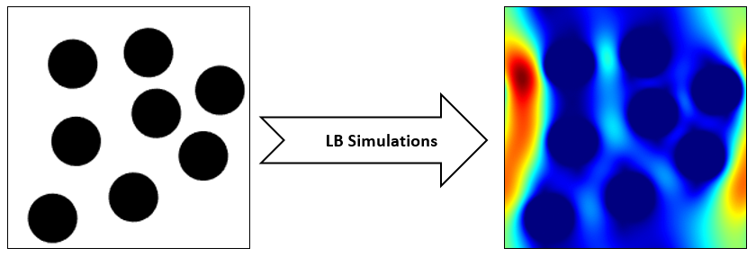
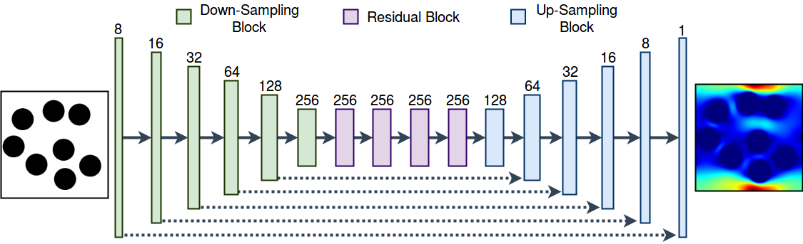
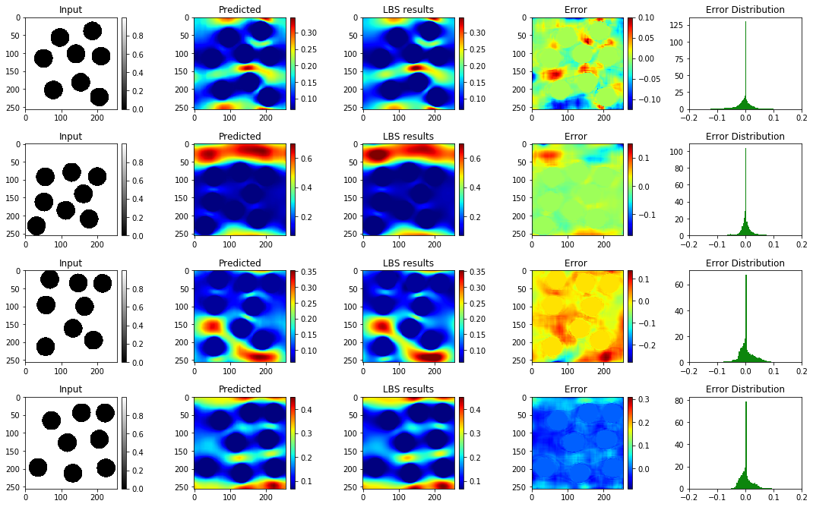
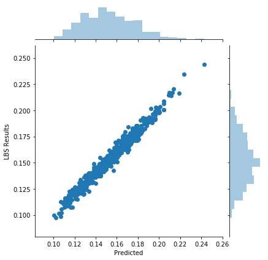

# Physics-based data-driven modeling

## Objective
The objective for this work is to develop a data-driven proxy to high-fidelity numerical flow simulations using digital images. 
The proposed model can capture the flow field and permeability in a large verity of digital porous media based on solid grain geometry and pore size distribution by detailed analyses of the local pore geometry and the local flow fields. 
To develop the model, the detailed pore space geometry and simulation runs data from 3500 two-dimensional high-fidelity Lattice Boltzmann simulation runs are used to train and to predict the solutions with a high accuracy in much less computational time. 
The proposed methodology harness the enormous amount of generated data from high-fidelity flow simulations to decode the often under-utilized patterns in simulations and to accurately predict solutions to new cases.
The developed model can truly capture the physics of the problem and enhance prediction capabilities of the simulations at a much lower cost. 

## Architecture set-up
The proposed network consists of 6 strided convolutions which reduce the size of input by a factor of 64, followed by four residual blocks.  Each  residual  block  consists of  two  3x3  convolutional  layers. Finally, In  order  to  obtain  the  final  prediction map, we add six subsequent up-sampling blocks on top of the residual blocks. The input to each up-sampling block is the feature maps of the previous layer concatenated in depth with those of contracting down-sampling path. As mentioned earlier each up-sampling block comprises successive NN-upsampling and 3x3 convolution with unit stride. Note that all the convolutions are followed by a Batch Normalization and Relu activation function. 
 Since our input (geometry input image) is the simulated velocity fields we employ reflection 1x1 padding for all the convolutions.

## Results
To develop the model, simulation cases are divided into two sections. 
The first section with 85\% of the data (3,000 image pairs out of 3,550 total pairs) is used to train the model while the remaining 15\% of the data are used as test data. 
The test portion of the data, which is not used in the training process, is only used to examine the predictive capabilities, and the robustness of the model. 
All the simulations are tested to verify that they have reached steady state conditions, where kinetic energy of the system becomes constant. 
The binary images are used for the LB simulations (Figure \ref{error}a). 
The regions away from the solid-pore interfaces exhibit higher velocity values compared the ones adjacent to the interfaces. Contour plots of x-direction velocity for the developed model (Figure \ref{error}b) and those taken from the LB simulations (Figure \ref{error}c) show similar behavior. The contour plots in Figure \ref{error}c are adjusted based on the minimum and maximum values obtained in contours in Figure b. 
The behavior in Figure b and c are fairly similar, except for the high (hot-colored) values in Figure \ref{error}c. The positions of the circles (zero-velocity valued pixels in Figure b and Figure \ref{error}c) are accurately predicted. 
The error plots (Figure \ref{error}d) exhibit errors in the domain. 
The error for most of the cases are bounded within 20\% errors (Figure \ref{error}e), confirming the plausibility of the approach to replicate costly numerical simulations.

The predicted mean of x-direction velocity values for all test cases are shown in the following fugure. All the points are projected along the unit-slope line, which shows that predicted values are fairly close to the LB simulation results.

